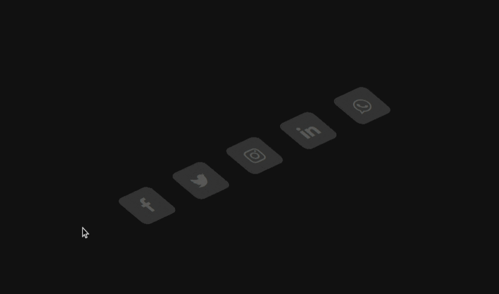
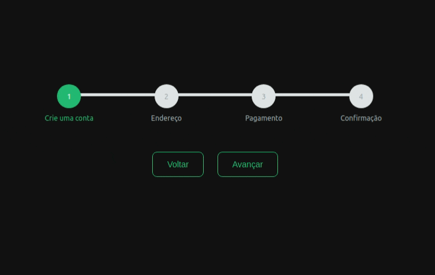
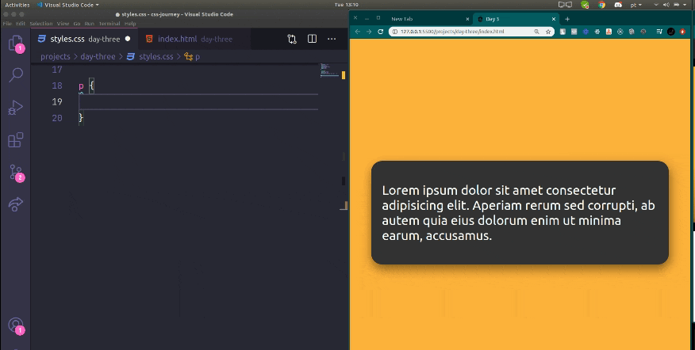

# 🛸 CSS Journey
## The Jouney

Aqui vou documentar minha jornada em busca de melhorar minhas habilidades com CSS(ou pelo menos tentar rsrs).

### Day 1

[Meu Código](https://github.com/artursantiago/css-journey/tree/master/projects/day-one)

O que aprendi:
  - Utilizar a funcção translate() do transform para mover as layers no hover.
  - Utilizar a propriedade opacity para causar um efeito de distanciamento das layers.
  - Utilizar as funções rotate() e skew() para deixar o ícone com aspecto "3D".

### Day 2

[Meu Código](https://github.com/artursantiago/css-journey/tree/master/projects/day-two)

O que aprendi:
  - Criar uma progress bar dinâmica para formulários.
  - Utilizar atributos do html para estilização no css, com a função attr(data-step).
  - Utilizar a função calc() alinhar horizontalmente um elemento com position absolute. Ex: left: calc(50% - 20px).

### Day 3

[Meu Código](https://github.com/artursantiago/css-journey/tree/master/projects/day-three)

O que aprendi:
  - Aprendi a subistituir "..." em textos que extrapolaram o tamanho do seu container.